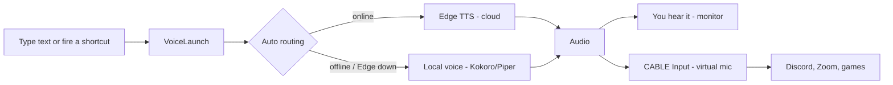

# VoiceLaunch TTS

[](https://github.com/skarL007/sound_voice/actions/workflows/test.yml)
[](LICENSE)
[](https://github.com/skarL007/sound_voice/releases)
[](https://github.com/skarL007/sound_voice/releases/latest)

**A free, open-source text-to-speech launcher that turns your typing into a real microphone for Discord and any game.**

Type a phrase → hear a natural voice → it comes out of your **virtual microphone** so everyone in your Discord call or game voice chat hears it. Hundreds of Microsoft Edge TTS voices work instantly with no install and no account. When you go offline, a local voice takes over automatically. No telemetry.

> Built for people who can't or prefer not to speak, for gamers who want a voice in chat, and for anyone who needs fast, private, assistive communication.

**🌐 Website: [skarl007.github.io/sound_voice](https://skarl007.github.io/sound_voice/)** · **⬇️ [Download](https://github.com/skarL007/sound_voice/releases/latest)**

---

## Why VoiceLaunch

- **Your voice in Discord and any game.** The generated speech is routed into a virtual microphone (VB-Cable), so any app that reads from a mic — Discord, Zoom, in-game voice chat — hears it. VB-Cable ships inside the installer and sets itself up.
- **Smart voice routing.** In **Auto** mode the app uses online Edge TTS when you have internet and instantly falls back to a local voice (Kokoro/Piper) when you're offline or the connection drops — no setting to flip.
- **Instant, no account.** Hundreds of natural Edge TTS voices work the moment you open the app. Nothing to download, no sign-up, no telemetry.
- **Global voice shortcuts.** Bind a phrase to a hotkey and fire it from inside a game without alt-tabbing.
- **Built for accessibility.** Persistent history and draft, quick phrases, an on-screen keyboard, high-contrast and large-font modes, full keyboard navigation, and visible focus.

---

## Install

### Download (recommended)

1. Go to [Releases](https://github.com/skarL007/sound_voice/releases/latest).
2. Download the latest installer (`VoiceLaunch-TTS-Setup-<version>.exe`).
3. Run it. The bundled **VB-Audio Virtual Cable** installs automatically if it isn't already present (a Windows restart may be required).

#### Windows SmartScreen

This is an unsigned open-source build, so Windows shows **"Windows protected your PC."** Click **More info → Run anyway**. This is expected for unsigned installers.

#### Verify the download (optional but recommended)

Every release publishes the SHA-256 of the installer. Confirm your download matches:

```powershell
Get-FileHash -Algorithm SHA256 .\VoiceLaunch-TTS-Setup-<version>.exe
```

Compare the output against the hash in the [release notes](https://github.com/skarL007/sound_voice/releases/latest).

### System requirements

| Requirement | Minimum | Recommended |
|-------------|---------|-------------|
| OS | Windows 10 x64 | Windows 11 x64 |
| RAM | 4 GB | 8 GB |
| Storage | 2 GB free | 10 GB (for local models) |
| GPU | Any (Edge TTS runs on all hardware) | NVIDIA with CUDA (for XTTS v2 cloning) |
| Internet | Required for cloud Edge TTS voices | Optional once local models are downloaded |

---

## Use it in Discord (or any game)

1. Open VoiceLaunch and enable the **virtual mic** (the app auto-selects `CABLE Input`).
2. In Discord: **Settings → Voice & Video → Input Device → `CABLE Output (VB-Audio Virtual Cable)`**.
3. Type a phrase and hit **Speak**, or fire a **voice shortcut** hotkey while the game has focus.

Anyone in the channel now hears your generated voice. The same `CABLE Output` device works as the "microphone" in any game's voice-chat settings.

---

## Development

### Prerequisites

- Windows 10/11
- Node.js 20+
- Python 3.12 (only needed to build the bundled local backend)

### Quick start

```sh
git clone https://github.com/skarL007/sound_voice.git
cd sound_voice
npm install
npm run dev
```

The app opens with cloud Edge TTS voices working immediately. Local voices (Piper/Kokoro) require the packaged Python backend — see [CONTRIBUTING.md](CONTRIBUTING.md).

### Verify

```sh
npm run type-check
npm test
```

### Build the installer

```sh
npm run dist:win
```

For architecture and how the pieces fit together, see [docs/ARCHITECTURE.md](docs/ARCHITECTURE.md).

---

## How it works



The cloud path renders in the app itself and fans the audio out to the virtual-mic device; the local path renders in the Python backend. See [docs/ARCHITECTURE.md](docs/ARCHITECTURE.md) for the full picture.

## Voices

| Model | Status | Notes |
|-------|--------|-------|
| Edge TTS (cloud) | Default | Hundreds of voices, no install, needs internet |
| Piper | Stable (local) | Lightweight, CPU-only, works offline |
| Kokoro | Stable (local) | Higher quality (MOS 4.2), still CPU-friendly |
| XTTS v2 | Advanced (local) | Voice cloning; NVIDIA + CUDA only |
| MeloTTS / Fish Speech / Bark | Experimental | Outside the main flow |

Local voices are auto-selected by hardware tier in Auto mode. The recommended local path is Piper first, Kokoro for better quality.

## Repository layout

```text
src/
  main/       Electron main process (lifecycle, IPC, Python backend, Edge TTS client)
  preload/    secure context bridge to the renderer
  renderer/   React app (Speak, Shortcuts, Settings, compact mode)
  python/     FastAPI backend and TTS engine wrappers
  shared/     shared TypeScript types
docs/         architecture, accessibility, virtual mic, release validation
```

## Documentation

- [Architecture](docs/ARCHITECTURE.md)
- [Accessibility](docs/ACCESSIBILITY.md)
- [Virtual microphone guide](docs/VIRTUAL_MIC.md)
- [Release validation protocol](docs/RELEASE_VALIDATION.md)
- [Contributing](CONTRIBUTING.md)
- [Security policy](SECURITY.md)

## Data & logs

- Logs: `%APPDATA%\voicelaunch-tts\logs\`
- Models: `%APPDATA%\voicelaunch-tts\models\`
- Cloned voices: `%APPDATA%\voicelaunch-tts\voices\`

## License

MIT — see [LICENSE](LICENSE).
