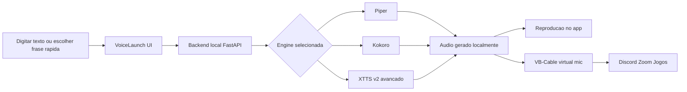

# VoiceLaunch TTS

VoiceLaunch TTS e um launcher desktop open source para comunicacao assistiva local. Ele transforma texto em voz no proprio computador e pode enviar esse audio para reproducao local ou para um microfone virtual em apps como Discord, Zoom e jogos.

O projeto foi pensado para pessoas que usam voz sintetizada no dia a dia, pessoas nao falantes e qualquer pessoa que precise se comunicar com mais rapidez, autonomia e privacidade.

## Estado atual do projeto

- **MVP local estabilizado**
- **Fluxo principal validado:** `Piper -> Kokoro -> microfone virtual`
- **Recurso avancado:** `XTTS v2` apenas depois de validar `NVIDIA/CUDA`
- **Fora do caminho principal atual:** `MeloTTS`, `Fish Speech` e `Bark`

## Como o produto funciona



## Proposta do produto

- **Local-first:** a sintese principal roda no computador do usuario
- **Assistivo de verdade:** frases rapidas, historico persistente, rascunho persistente e atalhos globais
- **Fluxo honesto:** primeiro garantir a primeira fala com baixo atrito, depois liberar recursos avancados
- **Uso real:** audio local, comunicador compacto e microfone virtual no mesmo app

## Caminho recomendado do MVP

| Etapa | Objetivo | Resultado esperado |
|------|----------|--------------------|
| 1. Piper | Garantir a primeira fala local | Fluxo mais seguro e leve |
| 2. Kokoro | Melhorar qualidade mantendo simplicidade | Voz melhor sem sair do caminho principal |
| 3. VB-Cable | Levar a voz para outros aplicativos | Discord, Zoom, jogos e chamadas |
| 4. XTTS v2 | Recurso avancado opcional | Apenas com NVIDIA/CUDA validado |

## Suporte pratico por hardware

| Perfil | Caminho recomendado |
|--------|---------------------|
| CPU ou maquina basica | Piper primeiro, Kokoro depois |
| Windows com AMD | Piper e Kokoro como fluxo garantido |
| NVIDIA com CUDA validado | Piper e Kokoro no fluxo principal, XTTS v2 como avancado |

## Modelos no estado atual

| Modelo | Status | Observacao |
|--------|--------|------------|
| Piper | Estavel | Melhor ponto de partida para primeira fala local |
| Kokoro | Estavel | Melhor qualidade dentro do fluxo principal |
| XTTS v2 | Avancado | Recomendado apenas com NVIDIA/CUDA validado |
| MeloTTS | Experimental | Fora do fluxo principal atual |
| Fish Speech | Experimental | Fora do fluxo principal atual |
| Bark | Experimental | Fora do fluxo principal atual |

## Funcionalidades principais

- Execucao local offline depois dos downloads iniciais
- Download e gestao de modelos pela interface
- Frases rapidas personalizaveis e historico persistente
- Comunicador compacto com atalhos globais
- Microfone virtual com VB-Cable
- Onboarding para primeira fala local
- UI pensada para teclado, foco visivel, alto contraste e fonte grande

## Requisitos

- Windows 10/11 x64
- 4 GB RAM minimo
- 8 GB RAM ou mais recomendado
- GPU NVIDIA opcional para `XTTS v2`
- Python 3.10+ apenas para desenvolvimento

## Desenvolvimento local

```bash
npm install
pip install -r src/python/requirements-core.txt
pip install -r src/python/requirements-piper.txt
pip install -r src/python/requirements-kokoro.txt

# opcional para clonagem avancada
pip install -r src/python/requirements-xtts.txt

npm run dev
npm run build
npm run dist:win
```

## Arquitetura

- **Electron Main:** ciclo de vida do app, janela, IPC e backend Python
- **React Renderer:** setup, catalogo de modelos, fala, configuracoes e comunicador compacto
- **Python Backend / FastAPI:** inferencia TTS, audio, modelos e recursos avancados

## Estrutura do repositorio

```text
src/
  main/       processo principal Electron
  preload/    bridge segura para o renderer
  renderer/   app React
  python/     backend FastAPI e wrappers TTS
  shared/     tipos compartilhados
docs/         beta, acessibilidade, arquitetura e operacao
codex.md      checkpoint operacional da ultima sessao
```

## Documentacao operacional

- [Acessibilidade](docs/ACCESSIBILITY.md)
- [Programa de Beta](docs/BETA_PROGRAM.md)
- [Guia de Microfone Virtual](docs/VIRTUAL_MIC.md)
- [Checkpoint da ultima sessao](codex.md)

## Artefatos e logs

- Logs: `%APPDATA%\\VoiceLaunch\\logs\\`
- Modelos: `%APPDATA%\\VoiceLaunch\\models\\`
- Vozes clonadas: `%APPDATA%\\VoiceLaunch\\voices\\`

## Licenca

MIT
