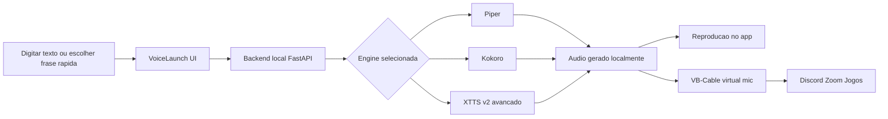

# VoiceLaunch TTS

[](https://github.com/skarL007/sound_voice/actions/workflows/test.yml)
[](LICENSE)
[](https://github.com/skarL007/sound_voice/releases)
[](https://github.com/skarL007/sound_voice/releases/latest)

**Open-source local text-to-speech launcher for assistive communication on Windows.**

Type text → hear a natural voice → route it as a virtual microphone to Discord, Zoom, or games.
Works offline after initial model download. No account required. No telemetry.

> O restante deste documento está em Português (Brasil). English docs are available in the [docs/](docs/) folder.

---

VoiceLaunch TTS é um launcher desktop open source para comunicação assistiva local. Ele transforma texto em voz no próprio computador e pode enviar esse áudio para reprodução local ou para um microfone virtual em apps como Discord, Zoom e jogos.

O projeto foi pensado para pessoas que usam voz sintetizada no dia a dia, pessoas não falantes e qualquer pessoa que precise se comunicar com mais rapidez, autonomia e privacidade.

---

## Instalação

### Download (recomendado)

1. Vá para [Releases](https://github.com/skarL007/sound_voice/releases/latest)
2. Baixe `VoiceLaunch-TTS-Setup-1.0.0.exe`
3. Execute o instalador

**Aviso do Windows SmartScreen:** porque este build não está com assinatura de código, o Windows vai mostrar "O Windows protegeu seu PC". Clique em **Mais informações → Executar assim mesmo**. Isso é esperado para instaladores open-source não assinados. Verifique o checksum SHA-256 nas notas da release se quiser confirmar a autenticidade do arquivo.

O **VB-Audio Virtual Cable** está incluído — o instalador vai configurá-lo automaticamente se não estiver presente. Um reinício do sistema pode ser necessário.

### Requisitos do sistema

| Requisito | Mínimo | Recomendado |
|-----------|--------|-------------|
| OS | Windows 10 x64 | Windows 11 x64 |
| RAM | 4 GB | 8 GB |
| Armazenamento | 2 GB livre | 10 GB (para modelos locais) |
| GPU | Qualquer (Edge TTS funciona em todo hardware) | NVIDIA com CUDA (para clonagem XTTS v2) |
| Internet | Necessária para vozes Edge TTS na nuvem | Opcional após download dos modelos |

---

## Desenvolvimento

### Pré-requisitos

- Windows 10/11
- Node.js 20+
- Python 3.10+ (apenas para buildar o backend bundled)

### Início rápido

```sh
git clone https://github.com/skarL007/sound_voice.git
cd sound_voice
npm install
npm run dev
```

O app abre com as vozes Edge TTS na nuvem funcionando imediatamente. Vozes locais (Piper/Kokoro) requerem o bundle Python. Veja [CONTRIBUTING.md](CONTRIBUTING.md) para instruções completas.

### Rodar testes

```sh
npm test
```

### Buildar instalador

```sh
npm run dist:win
```

---

## Estado atual do projeto

- **MVP local estabilizado**
- **Fluxo principal validado:** `Piper -> Kokoro -> microfone virtual`
- **Recurso avançado:** `XTTS v2` apenas depois de validar `NVIDIA/CUDA`
- **Fora do caminho principal atual:** `MeloTTS`, `Fish Speech` e `Bark`

## Como o produto funciona



## Proposta do produto

- **Local-first:** a síntese principal roda no computador do usuário
- **Assistivo de verdade:** frases rápidas, histórico persistente, rascunho persistente e atalhos globais
- **Fluxo honesto:** primeiro garantir a primeira fala com baixo atrito, depois liberar recursos avançados
- **Uso real:** áudio local, comunicador compacto e microfone virtual no mesmo app

## Caminho recomendado do MVP

| Etapa | Objetivo | Resultado esperado |
|------|----------|--------------------|
| 1. Piper | Garantir a primeira fala local | Fluxo mais seguro e leve |
| 2. Kokoro | Melhorar qualidade mantendo simplicidade | Voz melhor sem sair do caminho principal |
| 3. VB-Cable | Levar a voz para outros aplicativos | Discord, Zoom, jogos e chamadas |
| 4. XTTS v2 | Recurso avançado opcional | Apenas com NVIDIA/CUDA validado |

## Suporte prático por hardware

| Perfil | Caminho recomendado |
|--------|---------------------|
| CPU ou máquina básica | Piper primeiro, Kokoro depois |
| Windows com AMD | Piper e Kokoro como fluxo garantido |
| NVIDIA com CUDA validado | Piper e Kokoro no fluxo principal, XTTS v2 como avançado |

## Modelos no estado atual

| Modelo | Status | Observação |
|--------|--------|------------|
| Piper | Estável | Melhor ponto de partida para primeira fala local |
| Kokoro | Estável | Melhor qualidade dentro do fluxo principal |
| XTTS v2 | Avançado | Recomendado apenas com NVIDIA/CUDA validado |
| MeloTTS | Experimental | Fora do fluxo principal atual |
| Fish Speech | Experimental | Fora do fluxo principal atual |
| Bark | Experimental | Fora do fluxo principal atual |

## Funcionalidades principais

- Execução local offline depois dos downloads iniciais
- Download e gestão de modelos pela interface
- ~400 vozes Edge TTS (nuvem) sem instalação
- Frases rápidas personalizáveis e histórico persistente
- Comunicador compacto com atalhos globais (Ctrl+Shift+1–9)
- Soundboard de atalhos de voz (31 slots)
- Microfone virtual com VB-Cable para Discord/Zoom/jogos
- Perfis separados (Padrão / Jogo) com frases diferentes
- Onboarding para primeira fala local
- UI pensada para teclado, foco visível, alto contraste e fonte grande

## Arquitetura

- **Electron Main:** ciclo de vida do app, janela, IPC e backend Python
- **React Renderer:** setup, catálogo de modelos, fala, configurações e comunicador compacto
- **Python Backend / FastAPI:** inferência TTS, áudio, modelos e recursos avançados

## Estrutura do repositório

```text
src/
  main/       processo principal Electron
  preload/    bridge segura para o renderer
  renderer/   app React
  python/     backend FastAPI e wrappers TTS
  shared/     tipos compartilhados
docs/         beta, acessibilidade, arquitetura e operação
codex.md      checkpoint operacional da última sessão
```

## Documentação operacional

- [Acessibilidade](docs/ACCESSIBILITY.md)
- [Programa de Beta](docs/BETA_PROGRAM.md)
- [Guia de Microfone Virtual](docs/VIRTUAL_MIC.md)
- [Contribuindo](CONTRIBUTING.md)
- [Política de Segurança](SECURITY.md)

## Artefatos e logs

- Logs: `%APPDATA%\voicelaunch-tts\logs\`
- Modelos: `%APPDATA%\voicelaunch-tts\models\`
- Vozes clonadas: `%APPDATA%\voicelaunch-tts\voices\`

## Licença

MIT — veja [LICENSE](LICENSE).
